Airline Final
================
2025-11-28

``` r
df <- read_csv("ecommerce_customer_behavior_dataset.csv")
```

    ## Rows: 5000 Columns: 18
    ## ── Column specification ────────────────────────────────────────────────────────
    ## Delimiter: ","
    ## chr  (7): Order_ID, Customer_ID, Gender, City, Product_Category, Payment_Met...
    ## dbl  (9): Age, Unit_Price, Quantity, Discount_Amount, Total_Amount, Session_...
    ## lgl  (1): Is_Returning_Customer
    ## date (1): Date
    ## 
    ## ℹ Use `spec()` to retrieve the full column specification for this data.
    ## ℹ Specify the column types or set `show_col_types = FALSE` to quiet this message.

# Link to data: <https://www.kaggle.com/datasets/umuttuygurr/e-commerce-customer-behavior-and-sales-analysis-tr?select=ecommerce_customer_behavior_dataset.csv>

``` r
colSums(is.na(df))
```

    ##                 Order_ID              Customer_ID                     Date 
    ##                        0                        0                        0 
    ##                      Age                   Gender                     City 
    ##                        0                        0                        0 
    ##         Product_Category               Unit_Price                 Quantity 
    ##                        0                        0                        0 
    ##          Discount_Amount             Total_Amount           Payment_Method 
    ##                        0                        0                        0 
    ##              Device_Type Session_Duration_Minutes             Pages_Viewed 
    ##                        0                        0                        0 
    ##    Is_Returning_Customer       Delivery_Time_Days          Customer_Rating 
    ##                        0                        0                        0

``` r
ggplot(df, aes(Customer_Rating)) +
  geom_histogram()
```

    ## `stat_bin()` using `bins = 30`. Pick better value `binwidth`.

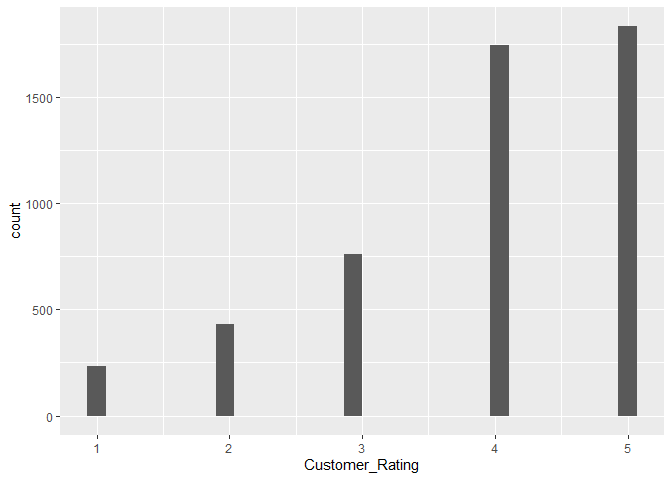<!-- --> \# Remove
ID columns

``` r
df <- df %>%
  select(-Order_ID, -Customer_ID)
```

# Just grab the months from the date column and then turn that into seasons.

``` r
library(lubridate)
df$Season <- case_when(
  month(df$Date) %in% c(12, 1, 2) ~ "Winter",
  month(df$Date) %in% c(3, 4, 5) ~ "Spring",
  month(df$Date) %in% c(6, 7, 8) ~ "Summer",
  month(df$Date) %in% c(9, 10, 11) ~ "Fall",
)
```

# Remove date column

``` r
df <- df %>%
  select(-Date)
```

``` r
summary(df)
```

    ##       Age           Gender              City           Product_Category  
    ##  Min.   :18.00   Length:5000        Length:5000        Length:5000       
    ##  1st Qu.:27.00   Class :character   Class :character   Class :character  
    ##  Median :35.00   Mode  :character   Mode  :character   Mode  :character  
    ##  Mean   :35.03                                                           
    ##  3rd Qu.:42.00                                                           
    ##  Max.   :75.00                                                           
    ##    Unit_Price         Quantity    Discount_Amount    Total_Amount     
    ##  Min.   :   5.18   Min.   :1.00   Min.   :   0.00   Min.   :    7.87  
    ##  1st Qu.:  76.59   1st Qu.:1.00   1st Qu.:   0.00   1st Qu.:  122.52  
    ##  Median : 182.95   Median :2.00   Median :   0.00   Median :  337.91  
    ##  Mean   : 455.83   Mean   :2.22   Mean   :  24.85   Mean   :  983.11  
    ##  3rd Qu.: 513.93   3rd Qu.:3.00   3rd Qu.:   8.76   3rd Qu.:  979.70  
    ##  Max.   :7159.45   Max.   :5.00   Max.   :1525.55   Max.   :22023.90  
    ##  Payment_Method     Device_Type        Session_Duration_Minutes
    ##  Length:5000        Length:5000        Min.   : 1.00           
    ##  Class :character   Class :character   1st Qu.: 8.00           
    ##  Mode  :character   Mode  :character   Median :13.00           
    ##                                        Mean   :14.57           
    ##                                        3rd Qu.:19.00           
    ##                                        Max.   :73.00           
    ##   Pages_Viewed    Is_Returning_Customer Delivery_Time_Days Customer_Rating
    ##  Min.   : 1.000   Mode :logical         Min.   : 1.000     Min.   :1.000  
    ##  1st Qu.: 7.000   FALSE:2010            1st Qu.: 4.000     1st Qu.:3.000  
    ##  Median : 9.000   TRUE :2990            Median : 6.000     Median :4.000  
    ##  Mean   : 8.984                         Mean   : 6.497     Mean   :3.903  
    ##  3rd Qu.:11.000                         3rd Qu.: 8.000     3rd Qu.:5.000  
    ##  Max.   :24.000                         Max.   :25.000     Max.   :5.000  
    ##     Season         
    ##  Length:5000       
    ##  Class :character  
    ##  Mode  :character  
    ##                    
    ##                    
    ## 

``` r
ggplot(df, aes(Age)) +
  geom_histogram()
```

    ## `stat_bin()` using `bins = 30`. Pick better value `binwidth`.

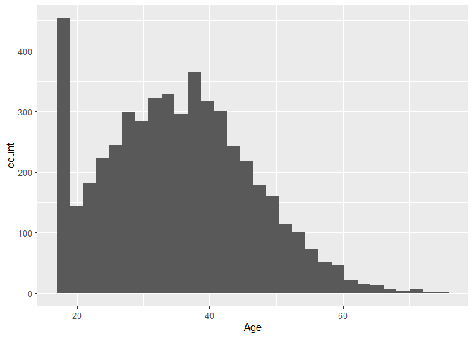<!-- -->

# Check and make sure the category columns have a reasonable amount of choices, if not then create subsections

``` r
n_distinct(df$Gender)
```

    ## [1] 3

``` r
unique(df$Gender)
```

    ## [1] "Female" "Male"   "Other"

``` r
n_distinct(df$City)
```

    ## [1] 10

``` r
n_distinct(df$Product_Category)
```

    ## [1] 8

``` r
n_distinct(df$Payment_Method)
```

    ## [1] 5

``` r
n_distinct(df$Device_Type)
```

    ## [1] 3

``` r
ggplot(df, aes(Unit_Price)) +
  geom_histogram()
```

    ## `stat_bin()` using `bins = 30`. Pick better value `binwidth`.

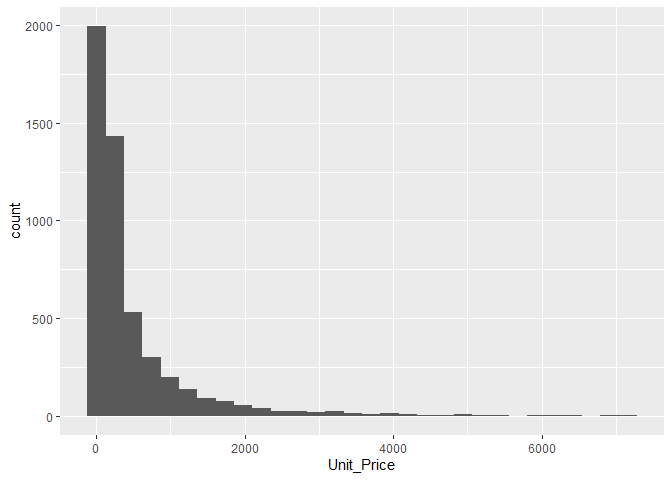<!-- -->

# Since Unit Price, and Total Price are very similar and in some cases the same I will drop unit price. I will also convert discount amount into a more simple yes or no discount column.

``` r
df <- df %>%
  mutate(Discount = ifelse(Discount_Amount > 0, "Yes", "No")) %>%
  select(-Unit_Price, -Discount_Amount) 
```

``` r
df %>%
  count(Discount)
```

    ## # A tibble: 2 × 2
    ##   Discount     n
    ##   <chr>    <int>
    ## 1 No        3474
    ## 2 Yes       1526

``` r
str(df)
```

    ## tibble [5,000 × 15] (S3: tbl_df/tbl/data.frame)
    ##  $ Age                     : num [1:5000] 27 42 43 32 40 43 25 44 41 58 ...
    ##  $ Gender                  : chr [1:5000] "Female" "Male" "Female" "Male" ...
    ##  $ City                    : chr [1:5000] "Bursa" "Konya" "Ankara" "Istanbul" ...
    ##  $ Product_Category        : chr [1:5000] "Toys" "Toys" "Food" "Electronics" ...
    ##  $ Quantity                : num [1:5000] 1 1 5 1 5 1 2 2 5 4 ...
    ##  $ Total_Amount            : num [1:5000] 54.3 244.9 240.8 574.8 3778.1 ...
    ##  $ Payment_Method          : chr [1:5000] "Debit Card" "Credit Card" "Credit Card" "Credit Card" ...
    ##  $ Device_Type             : chr [1:5000] "Mobile" "Mobile" "Mobile" "Mobile" ...
    ##  $ Session_Duration_Minutes: num [1:5000] 4 11 7 8 21 14 10 10 24 8 ...
    ##  $ Pages_Viewed            : num [1:5000] 14 3 8 10 10 9 5 16 7 5 ...
    ##  $ Is_Returning_Customer   : logi [1:5000] TRUE TRUE TRUE FALSE TRUE TRUE ...
    ##  $ Delivery_Time_Days      : num [1:5000] 8 3 5 1 7 9 6 3 2 5 ...
    ##  $ Customer_Rating         : num [1:5000] 5 3 2 4 4 5 5 5 4 4 ...
    ##  $ Season                  : chr [1:5000] "Winter" "Winter" "Winter" "Winter" ...
    ##  $ Discount                : chr [1:5000] "No" "No" "No" "Yes" ...

``` r
df <- df %>%
  mutate(across(where(is.character), as.factor))
```

``` r
str(df)
```

    ## tibble [5,000 × 15] (S3: tbl_df/tbl/data.frame)
    ##  $ Age                     : num [1:5000] 27 42 43 32 40 43 25 44 41 58 ...
    ##  $ Gender                  : Factor w/ 3 levels "Female","Male",..: 1 2 1 2 1 1 1 2 2 2 ...
    ##  $ City                    : Factor w/ 10 levels "Adana","Ankara",..: 4 10 2 7 7 7 8 10 7 7 ...
    ##  $ Product_Category        : Factor w/ 8 levels "Beauty","Books",..: 8 8 5 3 7 1 3 5 4 7 ...
    ##  $ Quantity                : num [1:5000] 1 1 5 1 5 1 2 2 5 4 ...
    ##  $ Total_Amount            : num [1:5000] 54.3 244.9 240.8 574.8 3778.1 ...
    ##  $ Payment_Method          : Factor w/ 5 levels "Bank Transfer",..: 4 3 3 3 2 3 5 3 3 4 ...
    ##  $ Device_Type             : Factor w/ 3 levels "Desktop","Mobile",..: 2 2 2 2 1 2 1 2 3 1 ...
    ##  $ Session_Duration_Minutes: num [1:5000] 4 11 7 8 21 14 10 10 24 8 ...
    ##  $ Pages_Viewed            : num [1:5000] 14 3 8 10 10 9 5 16 7 5 ...
    ##  $ Is_Returning_Customer   : logi [1:5000] TRUE TRUE TRUE FALSE TRUE TRUE ...
    ##  $ Delivery_Time_Days      : num [1:5000] 8 3 5 1 7 9 6 3 2 5 ...
    ##  $ Customer_Rating         : num [1:5000] 5 3 2 4 4 5 5 5 4 4 ...
    ##  $ Season                  : Factor w/ 4 levels "Fall","Spring",..: 4 4 4 4 4 4 4 4 4 4 ...
    ##  $ Discount                : Factor w/ 2 levels "No","Yes": 1 1 1 2 1 1 1 1 2 2 ...

``` r
df <- df %>%
  mutate(Is_Returning_Customer = as.factor(Is_Returning_Customer))
```

``` r
summary(df)
```

    ##       Age           Gender           City           Product_Category
    ##  Min.   :18.00   Female:2492   Istanbul:1284   Sports       : 667   
    ##  1st Qu.:27.00   Male  :2435   Ankara  : 735   Electronics  : 624   
    ##  Median :35.00   Other :  73   Izmir   : 600   Fashion      : 622   
    ##  Mean   :35.03                 Bursa   : 496   Beauty       : 621   
    ##  3rd Qu.:42.00                 Adana   : 378   Home & Garden: 621   
    ##  Max.   :75.00                 Antalya : 374   Food         : 619   
    ##                                (Other) :1133   (Other)      :1226   
    ##     Quantity     Total_Amount               Payment_Method  Device_Type  
    ##  Min.   :1.00   Min.   :    7.87   Bank Transfer   : 510   Desktop:1711  
    ##  1st Qu.:1.00   1st Qu.:  122.52   Cash on Delivery: 248   Mobile :2795  
    ##  Median :2.00   Median :  337.91   Credit Card     :2012   Tablet : 494  
    ##  Mean   :2.22   Mean   :  983.11   Debit Card      :1265                 
    ##  3rd Qu.:3.00   3rd Qu.:  979.70   Digital Wallet  : 965                 
    ##  Max.   :5.00   Max.   :22023.90                                         
    ##                                                                          
    ##  Session_Duration_Minutes  Pages_Viewed    Is_Returning_Customer
    ##  Min.   : 1.00            Min.   : 1.000   FALSE:2010           
    ##  1st Qu.: 8.00            1st Qu.: 7.000   TRUE :2990           
    ##  Median :13.00            Median : 9.000                        
    ##  Mean   :14.57            Mean   : 8.984                        
    ##  3rd Qu.:19.00            3rd Qu.:11.000                        
    ##  Max.   :73.00            Max.   :24.000                        
    ##                                                                 
    ##  Delivery_Time_Days Customer_Rating    Season     Discount  
    ##  Min.   : 1.000     Min.   :1.000   Fall  :1003   No :3474  
    ##  1st Qu.: 4.000     1st Qu.:3.000   Spring:1268   Yes:1526  
    ##  Median : 6.000     Median :4.000   Summer:1062             
    ##  Mean   : 6.497     Mean   :3.903   Winter:1667             
    ##  3rd Qu.: 8.000     3rd Qu.:5.000                           
    ##  Max.   :25.000     Max.   :5.000                           
    ## 

``` r
ggplot(df, aes(Total_Amount)) + 
  geom_histogram()
```

    ## `stat_bin()` using `bins = 30`. Pick better value `binwidth`.

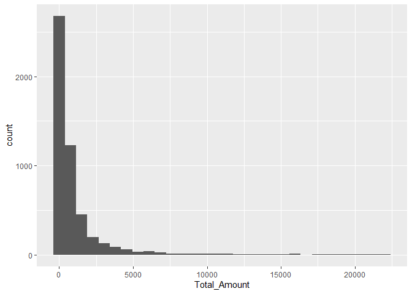<!-- -->

# Doing a log transformation of Total_Amount as it has a large right skew as some purchases were very large compared to others.

``` r
df$Log_Total_Amount <- log(df$Total_Amount)
```

``` r
ggplot(df, aes(Log_Total_Amount)) + 
  geom_histogram()
```

    ## `stat_bin()` using `bins = 30`. Pick better value `binwidth`.

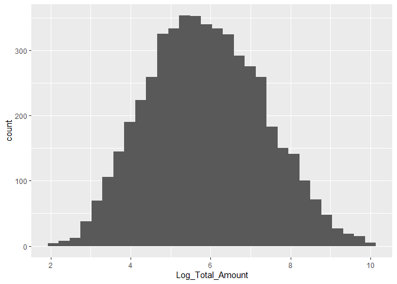<!-- -->

# Did a log transformation on total amount since it has a very severe right skew from some much more expensive items. Going to use the logged version in the modeling upcoming.

``` r
df <- df %>%
  select(-Total_Amount)
```

``` r
library(caret)
library(randomForest)

set.seed(8)
train_method_used = trainControl(method="cv", number = 5)

fit_caret_lm <- train(Customer_Rating ~ .,
                      data = df,
                      method = "lm",
                      trControl = train_method_used,
                      metric = "MAE")

fit_caret_rf = train(Customer_Rating ~ ., 
             data = df,
             method = "rf",
             trControl = train_method_used,
             tuneGrid = expand.grid(mtry = c(2,4,6)),
             ntree = 200,
             metric = "MAE")
```

    ## Warning in randomForest.default(x, y, mtry = param$mtry, ...): The response has
    ## five or fewer unique values.  Are you sure you want to do regression?
    ## Warning in randomForest.default(x, y, mtry = param$mtry, ...): The response has
    ## five or fewer unique values.  Are you sure you want to do regression?
    ## Warning in randomForest.default(x, y, mtry = param$mtry, ...): The response has
    ## five or fewer unique values.  Are you sure you want to do regression?
    ## Warning in randomForest.default(x, y, mtry = param$mtry, ...): The response has
    ## five or fewer unique values.  Are you sure you want to do regression?
    ## Warning in randomForest.default(x, y, mtry = param$mtry, ...): The response has
    ## five or fewer unique values.  Are you sure you want to do regression?
    ## Warning in randomForest.default(x, y, mtry = param$mtry, ...): The response has
    ## five or fewer unique values.  Are you sure you want to do regression?
    ## Warning in randomForest.default(x, y, mtry = param$mtry, ...): The response has
    ## five or fewer unique values.  Are you sure you want to do regression?
    ## Warning in randomForest.default(x, y, mtry = param$mtry, ...): The response has
    ## five or fewer unique values.  Are you sure you want to do regression?
    ## Warning in randomForest.default(x, y, mtry = param$mtry, ...): The response has
    ## five or fewer unique values.  Are you sure you want to do regression?
    ## Warning in randomForest.default(x, y, mtry = param$mtry, ...): The response has
    ## five or fewer unique values.  Are you sure you want to do regression?
    ## Warning in randomForest.default(x, y, mtry = param$mtry, ...): The response has
    ## five or fewer unique values.  Are you sure you want to do regression?
    ## Warning in randomForest.default(x, y, mtry = param$mtry, ...): The response has
    ## five or fewer unique values.  Are you sure you want to do regression?
    ## Warning in randomForest.default(x, y, mtry = param$mtry, ...): The response has
    ## five or fewer unique values.  Are you sure you want to do regression?
    ## Warning in randomForest.default(x, y, mtry = param$mtry, ...): The response has
    ## five or fewer unique values.  Are you sure you want to do regression?
    ## Warning in randomForest.default(x, y, mtry = param$mtry, ...): The response has
    ## five or fewer unique values.  Are you sure you want to do regression?
    ## Warning in randomForest.default(x, y, mtry = param$mtry, ...): The response has
    ## five or fewer unique values.  Are you sure you want to do regression?

``` r
all_MAE_CV <- c(min(fit_caret_lm$results$MAE),
                min(fit_caret_rf$results$MAE))

all_train_output <- list(fit_caret_lm,fit_caret_rf)

bestmodel_train_output <- all_train_output[[which.min(all_MAE_CV)]]

bestmodel_train_output
```

    ## Random Forest 
    ## 
    ## 5000 samples
    ##   14 predictor
    ## 
    ## No pre-processing
    ## Resampling: Cross-Validated (5 fold) 
    ## Summary of sample sizes: 4000, 4000, 3999, 4001, 4000 
    ## Resampling results across tuning parameters:
    ## 
    ##   mtry  RMSE      Rsquared     MAE      
    ##   2     1.132234  0.001221894  0.8791828
    ##   4     1.139313  0.001229529  0.8941857
    ##   6     1.142384  0.001538691  0.9012272
    ## 
    ## MAE was used to select the optimal model using the smallest value.
    ## The final value used for the model was mtry = 2.

``` r
fit_caret_lm
```

    ## Linear Regression 
    ## 
    ## 5000 samples
    ##   14 predictor
    ## 
    ## No pre-processing
    ## Resampling: Cross-Validated (5 fold) 
    ## Summary of sample sizes: 4001, 4000, 3999, 4001, 3999 
    ## Resampling results:
    ## 
    ##   RMSE      Rsquared      MAE      
    ##   1.132838  0.0009219508  0.8801258
    ## 
    ## Tuning parameter 'intercept' was held constant at a value of TRUE

``` r
fit_caret_rf$finalModel
```

    ## 
    ## Call:
    ##  randomForest(x = x, y = y, ntree = 200, mtry = param$mtry) 
    ##                Type of random forest: regression
    ##                      Number of trees: 200
    ## No. of variables tried at each split: 2
    ## 
    ##           Mean of squared residuals: 1.285972
    ##                     % Var explained: -0.99

# Random forest proved to be the best, with 2 variables tried at each split. The models are still not very good at predicting though, it has a negative percent Var explained, showing that it may be preforming worse than a simple model. We also see that the R squared is almost at 0, which shows that there is not much of the variation of customer reviews explained by this model, and that there is not a strong relationship between the response and predictor variables.

``` r
n = nrow(df)  
nfolds_outer = 5  
groups = rep(1:nfolds_outer,length=n)  
set.seed(8)
cvgroups = sample(groups,n)  

# set up storage for outer 5-fold cross-validation for model ASSESSMENT
allbesttrain = list(rep(NA,nfolds_outer))  
allpredicted_outer = rep(NA,n)  

train_method_used = trainControl(method="cv", number = 5)

for (jj in 1: nfolds_outer) {    
  in_train_outer = (cvgroups != jj)   
  in_test_outer = (cvgroups == jj)     

  train_set_outer = df[in_train_outer, ] 
  test_set_outer = df[in_test_outer, ]   
  
  dataused=train_set_outer
  
  
  fit_caret_lm_2 <- train(Customer_Rating ~ .,
                      data = dataused,
                      method = "lm",
                      trControl = train_method_used,
                      metric = "MAE")

  fit_caret_rf_2 = train(Customer_Rating ~ ., 
                     data = dataused,
                     method = "rf",
                     trControl = train_method_used,
                     tuneGrid = expand.grid(mtry = c(2,4,6)),
                     ntree = 200,
                     metric = "MAE")
        
  all_MAE_CV <- c(min(fit_caret_lm_2$results$MAE),
                  min(fit_caret_rf_2$results$MAE))
  
  all_train_output <- list(fit_caret_lm_2, fit_caret_rf_2)

  bestmodel_train_output <- all_train_output[[which.min(all_MAE_CV)]]


  allbesttrain[[jj]] = bestmodel_train_output

  allpredicted_outer[in_test_outer]  = bestmodel_train_output |> predict(test_set_outer)
}
```

    ## Warning in randomForest.default(x, y, mtry = param$mtry, ...): The response has
    ## five or fewer unique values.  Are you sure you want to do regression?
    ## Warning in randomForest.default(x, y, mtry = param$mtry, ...): The response has
    ## five or fewer unique values.  Are you sure you want to do regression?
    ## Warning in randomForest.default(x, y, mtry = param$mtry, ...): The response has
    ## five or fewer unique values.  Are you sure you want to do regression?
    ## Warning in randomForest.default(x, y, mtry = param$mtry, ...): The response has
    ## five or fewer unique values.  Are you sure you want to do regression?
    ## Warning in randomForest.default(x, y, mtry = param$mtry, ...): The response has
    ## five or fewer unique values.  Are you sure you want to do regression?
    ## Warning in randomForest.default(x, y, mtry = param$mtry, ...): The response has
    ## five or fewer unique values.  Are you sure you want to do regression?
    ## Warning in randomForest.default(x, y, mtry = param$mtry, ...): The response has
    ## five or fewer unique values.  Are you sure you want to do regression?
    ## Warning in randomForest.default(x, y, mtry = param$mtry, ...): The response has
    ## five or fewer unique values.  Are you sure you want to do regression?
    ## Warning in randomForest.default(x, y, mtry = param$mtry, ...): The response has
    ## five or fewer unique values.  Are you sure you want to do regression?
    ## Warning in randomForest.default(x, y, mtry = param$mtry, ...): The response has
    ## five or fewer unique values.  Are you sure you want to do regression?
    ## Warning in randomForest.default(x, y, mtry = param$mtry, ...): The response has
    ## five or fewer unique values.  Are you sure you want to do regression?
    ## Warning in randomForest.default(x, y, mtry = param$mtry, ...): The response has
    ## five or fewer unique values.  Are you sure you want to do regression?
    ## Warning in randomForest.default(x, y, mtry = param$mtry, ...): The response has
    ## five or fewer unique values.  Are you sure you want to do regression?
    ## Warning in randomForest.default(x, y, mtry = param$mtry, ...): The response has
    ## five or fewer unique values.  Are you sure you want to do regression?
    ## Warning in randomForest.default(x, y, mtry = param$mtry, ...): The response has
    ## five or fewer unique values.  Are you sure you want to do regression?
    ## Warning in randomForest.default(x, y, mtry = param$mtry, ...): The response has
    ## five or fewer unique values.  Are you sure you want to do regression?
    ## Warning in randomForest.default(x, y, mtry = param$mtry, ...): The response has
    ## five or fewer unique values.  Are you sure you want to do regression?
    ## Warning in randomForest.default(x, y, mtry = param$mtry, ...): The response has
    ## five or fewer unique values.  Are you sure you want to do regression?
    ## Warning in randomForest.default(x, y, mtry = param$mtry, ...): The response has
    ## five or fewer unique values.  Are you sure you want to do regression?
    ## Warning in randomForest.default(x, y, mtry = param$mtry, ...): The response has
    ## five or fewer unique values.  Are you sure you want to do regression?
    ## Warning in randomForest.default(x, y, mtry = param$mtry, ...): The response has
    ## five or fewer unique values.  Are you sure you want to do regression?
    ## Warning in randomForest.default(x, y, mtry = param$mtry, ...): The response has
    ## five or fewer unique values.  Are you sure you want to do regression?
    ## Warning in randomForest.default(x, y, mtry = param$mtry, ...): The response has
    ## five or fewer unique values.  Are you sure you want to do regression?
    ## Warning in randomForest.default(x, y, mtry = param$mtry, ...): The response has
    ## five or fewer unique values.  Are you sure you want to do regression?
    ## Warning in randomForest.default(x, y, mtry = param$mtry, ...): The response has
    ## five or fewer unique values.  Are you sure you want to do regression?
    ## Warning in randomForest.default(x, y, mtry = param$mtry, ...): The response has
    ## five or fewer unique values.  Are you sure you want to do regression?
    ## Warning in randomForest.default(x, y, mtry = param$mtry, ...): The response has
    ## five or fewer unique values.  Are you sure you want to do regression?
    ## Warning in randomForest.default(x, y, mtry = param$mtry, ...): The response has
    ## five or fewer unique values.  Are you sure you want to do regression?
    ## Warning in randomForest.default(x, y, mtry = param$mtry, ...): The response has
    ## five or fewer unique values.  Are you sure you want to do regression?
    ## Warning in randomForest.default(x, y, mtry = param$mtry, ...): The response has
    ## five or fewer unique values.  Are you sure you want to do regression?
    ## Warning in randomForest.default(x, y, mtry = param$mtry, ...): The response has
    ## five or fewer unique values.  Are you sure you want to do regression?
    ## Warning in randomForest.default(x, y, mtry = param$mtry, ...): The response has
    ## five or fewer unique values.  Are you sure you want to do regression?
    ## Warning in randomForest.default(x, y, mtry = param$mtry, ...): The response has
    ## five or fewer unique values.  Are you sure you want to do regression?
    ## Warning in randomForest.default(x, y, mtry = param$mtry, ...): The response has
    ## five or fewer unique values.  Are you sure you want to do regression?
    ## Warning in randomForest.default(x, y, mtry = param$mtry, ...): The response has
    ## five or fewer unique values.  Are you sure you want to do regression?
    ## Warning in randomForest.default(x, y, mtry = param$mtry, ...): The response has
    ## five or fewer unique values.  Are you sure you want to do regression?
    ## Warning in randomForest.default(x, y, mtry = param$mtry, ...): The response has
    ## five or fewer unique values.  Are you sure you want to do regression?
    ## Warning in randomForest.default(x, y, mtry = param$mtry, ...): The response has
    ## five or fewer unique values.  Are you sure you want to do regression?
    ## Warning in randomForest.default(x, y, mtry = param$mtry, ...): The response has
    ## five or fewer unique values.  Are you sure you want to do regression?
    ## Warning in randomForest.default(x, y, mtry = param$mtry, ...): The response has
    ## five or fewer unique values.  Are you sure you want to do regression?
    ## Warning in randomForest.default(x, y, mtry = param$mtry, ...): The response has
    ## five or fewer unique values.  Are you sure you want to do regression?
    ## Warning in randomForest.default(x, y, mtry = param$mtry, ...): The response has
    ## five or fewer unique values.  Are you sure you want to do regression?
    ## Warning in randomForest.default(x, y, mtry = param$mtry, ...): The response has
    ## five or fewer unique values.  Are you sure you want to do regression?
    ## Warning in randomForest.default(x, y, mtry = param$mtry, ...): The response has
    ## five or fewer unique values.  Are you sure you want to do regression?
    ## Warning in randomForest.default(x, y, mtry = param$mtry, ...): The response has
    ## five or fewer unique values.  Are you sure you want to do regression?
    ## Warning in randomForest.default(x, y, mtry = param$mtry, ...): The response has
    ## five or fewer unique values.  Are you sure you want to do regression?
    ## Warning in randomForest.default(x, y, mtry = param$mtry, ...): The response has
    ## five or fewer unique values.  Are you sure you want to do regression?
    ## Warning in randomForest.default(x, y, mtry = param$mtry, ...): The response has
    ## five or fewer unique values.  Are you sure you want to do regression?
    ## Warning in randomForest.default(x, y, mtry = param$mtry, ...): The response has
    ## five or fewer unique values.  Are you sure you want to do regression?
    ## Warning in randomForest.default(x, y, mtry = param$mtry, ...): The response has
    ## five or fewer unique values.  Are you sure you want to do regression?
    ## Warning in randomForest.default(x, y, mtry = param$mtry, ...): The response has
    ## five or fewer unique values.  Are you sure you want to do regression?
    ## Warning in randomForest.default(x, y, mtry = param$mtry, ...): The response has
    ## five or fewer unique values.  Are you sure you want to do regression?
    ## Warning in randomForest.default(x, y, mtry = param$mtry, ...): The response has
    ## five or fewer unique values.  Are you sure you want to do regression?
    ## Warning in randomForest.default(x, y, mtry = param$mtry, ...): The response has
    ## five or fewer unique values.  Are you sure you want to do regression?
    ## Warning in randomForest.default(x, y, mtry = param$mtry, ...): The response has
    ## five or fewer unique values.  Are you sure you want to do regression?
    ## Warning in randomForest.default(x, y, mtry = param$mtry, ...): The response has
    ## five or fewer unique values.  Are you sure you want to do regression?
    ## Warning in randomForest.default(x, y, mtry = param$mtry, ...): The response has
    ## five or fewer unique values.  Are you sure you want to do regression?
    ## Warning in randomForest.default(x, y, mtry = param$mtry, ...): The response has
    ## five or fewer unique values.  Are you sure you want to do regression?
    ## Warning in randomForest.default(x, y, mtry = param$mtry, ...): The response has
    ## five or fewer unique values.  Are you sure you want to do regression?
    ## Warning in randomForest.default(x, y, mtry = param$mtry, ...): The response has
    ## five or fewer unique values.  Are you sure you want to do regression?
    ## Warning in randomForest.default(x, y, mtry = param$mtry, ...): The response has
    ## five or fewer unique values.  Are you sure you want to do regression?
    ## Warning in randomForest.default(x, y, mtry = param$mtry, ...): The response has
    ## five or fewer unique values.  Are you sure you want to do regression?
    ## Warning in randomForest.default(x, y, mtry = param$mtry, ...): The response has
    ## five or fewer unique values.  Are you sure you want to do regression?
    ## Warning in randomForest.default(x, y, mtry = param$mtry, ...): The response has
    ## five or fewer unique values.  Are you sure you want to do regression?
    ## Warning in randomForest.default(x, y, mtry = param$mtry, ...): The response has
    ## five or fewer unique values.  Are you sure you want to do regression?
    ## Warning in randomForest.default(x, y, mtry = param$mtry, ...): The response has
    ## five or fewer unique values.  Are you sure you want to do regression?
    ## Warning in randomForest.default(x, y, mtry = param$mtry, ...): The response has
    ## five or fewer unique values.  Are you sure you want to do regression?
    ## Warning in randomForest.default(x, y, mtry = param$mtry, ...): The response has
    ## five or fewer unique values.  Are you sure you want to do regression?
    ## Warning in randomForest.default(x, y, mtry = param$mtry, ...): The response has
    ## five or fewer unique values.  Are you sure you want to do regression?
    ## Warning in randomForest.default(x, y, mtry = param$mtry, ...): The response has
    ## five or fewer unique values.  Are you sure you want to do regression?
    ## Warning in randomForest.default(x, y, mtry = param$mtry, ...): The response has
    ## five or fewer unique values.  Are you sure you want to do regression?
    ## Warning in randomForest.default(x, y, mtry = param$mtry, ...): The response has
    ## five or fewer unique values.  Are you sure you want to do regression?
    ## Warning in randomForest.default(x, y, mtry = param$mtry, ...): The response has
    ## five or fewer unique values.  Are you sure you want to do regression?
    ## Warning in randomForest.default(x, y, mtry = param$mtry, ...): The response has
    ## five or fewer unique values.  Are you sure you want to do regression?
    ## Warning in randomForest.default(x, y, mtry = param$mtry, ...): The response has
    ## five or fewer unique values.  Are you sure you want to do regression?
    ## Warning in randomForest.default(x, y, mtry = param$mtry, ...): The response has
    ## five or fewer unique values.  Are you sure you want to do regression?
    ## Warning in randomForest.default(x, y, mtry = param$mtry, ...): The response has
    ## five or fewer unique values.  Are you sure you want to do regression?
    ## Warning in randomForest.default(x, y, mtry = param$mtry, ...): The response has
    ## five or fewer unique values.  Are you sure you want to do regression?
    ## Warning in randomForest.default(x, y, mtry = param$mtry, ...): The response has
    ## five or fewer unique values.  Are you sure you want to do regression?
    ## Warning in randomForest.default(x, y, mtry = param$mtry, ...): The response has
    ## five or fewer unique values.  Are you sure you want to do regression?

``` r
# assessment
y = df$Customer_Rating
gf_point(y ~ allpredicted_outer)
```

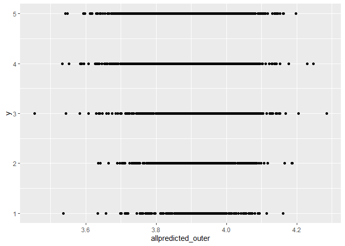<!-- -->

``` r
# This line will compute the models best estimate for future performance
MAE_outer = mean(abs(y - allpredicted_outer)); MAE_outer
```

    ## [1] 0.8823509

# We see that we will likely be .882 rating off of future customer reviews. It is not terrible, but it is also not great.

``` r
min(fit_caret_lm_2$results$MAE)
```

    ## [1] 0.8833281

``` r
min(fit_caret_rf_2$results$MAE)
```

    ## [1] 0.8820845

# Random Forest has the lower MAE value

``` r
final_model <- fit_caret_rf$finalModel
final_model
```

    ## 
    ## Call:
    ##  randomForest(x = x, y = y, ntree = 200, mtry = param$mtry) 
    ##                Type of random forest: regression
    ##                      Number of trees: 200
    ## No. of variables tried at each split: 2
    ## 
    ##           Mean of squared residuals: 1.285972
    ##                     % Var explained: -0.99

``` r
varImpPlot(final_model)
```

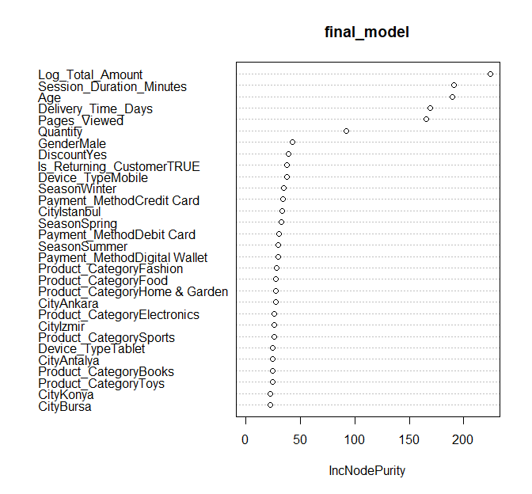<!-- -->

``` r
varImp(final_model) %>%
  arrange(desc(Overall))
```

    ##                                  Overall
    ## Log_Total_Amount               224.35576
    ## Session_Duration_Minutes       190.96192
    ## Age                            189.83288
    ## Delivery_Time_Days             169.43123
    ## Pages_Viewed                   165.30136
    ## Quantity                        91.87908
    ## GenderMale                      42.47407
    ## DiscountYes                     39.25603
    ## Is_Returning_CustomerTRUE       37.92152
    ## Device_TypeMobile               37.88378
    ## SeasonWinter                    34.43181
    ## Payment_MethodCredit Card       33.82195
    ## CityIstanbul                    33.01286
    ## SeasonSpring                    32.42084
    ## Payment_MethodDebit Card        30.35759
    ## SeasonSummer                    29.38913
    ## Payment_MethodDigital Wallet    29.36395
    ## Product_CategoryFashion         28.25761
    ## Product_CategoryFood            27.80235
    ## Product_CategoryHome & Garden   27.66141
    ## CityAnkara                      27.57137
    ## Product_CategoryElectronics     26.15949
    ## CityIzmir                       26.09944
    ## Product_CategorySports          25.79343
    ## Device_TypeTablet               24.72717
    ## CityAntalya                     24.71456
    ## Product_CategoryBooks           24.58900
    ## Product_CategoryToys            24.42914
    ## CityKonya                       22.77238
    ## CityBursa                       22.74488
    ## CityKayseri                     22.11323
    ## CityGaziantep                   20.99930
    ## CityEskisehir                   18.69300
    ## Payment_MethodCash on Delivery  18.28570
    ## GenderOther                     14.04681

# We can see here which variables the model found most important.

``` r
cor(df$Customer_Rating, df$Log_Total_Amount)
```

    ## [1] 0.003090703

``` r
cor(df$Customer_Rating, df$Session_Duration_Minutes)
```

    ## [1] 0.0257253

``` r
cor(df$Customer_Rating, df$Age)
```

    ## [1] -0.01040054

# As expected from the model results, the correlation of the response to even the 3 most important predictors is very small.

``` r
source("gf_partialPlot.R")
gf_partialPlot(
  model = fit_caret_rf,
  df = df,
  x.var = "Log_Total_Amount"
)
```

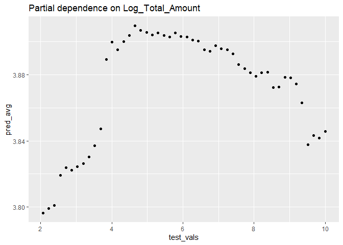<!-- -->

``` r
source("gf_partialPlot.R")
gf_partialPlot(
  model = fit_caret_rf,
  df = df,
  x.var = "Session_Duration_Minutes"
)
```

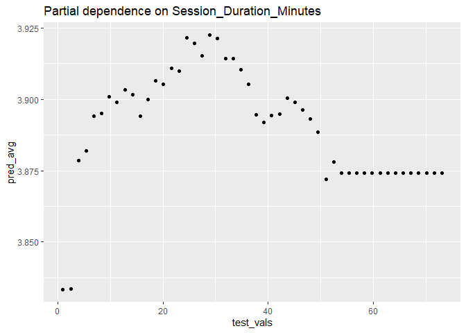<!-- -->

``` r
source("gf_partialPlot.R")
gf_partialPlot(
  model = fit_caret_rf,
  df = df,
  x.var = "Age"
)
```

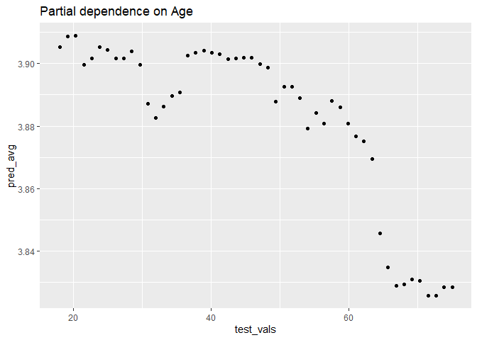<!-- -->

``` r
df$predict_review <- predict(fit_caret_rf, newdata = df)
```

``` r
ggplot(df, aes(x = Session_Duration_Minutes,  y = predict_review)) +
  geom_point() +
  geom_smooth(method = "lm", se = FALSE)
```

    ## `geom_smooth()` using formula = 'y ~ x'

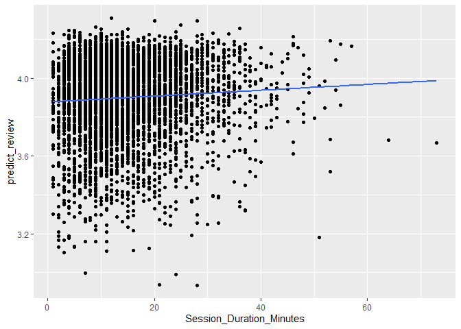<!-- -->

``` r
ggplot(df, aes(x = Age,  y = predict_review)) +
  geom_point() +
  geom_smooth(method = "lm", se = FALSE)
```

    ## `geom_smooth()` using formula = 'y ~ x'

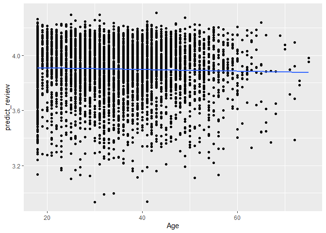<!-- -->

``` r
ggplot(df, aes(x = Log_Total_Amount,  y = predict_review)) +
  geom_point() +
  geom_smooth(method = "lm", se = FALSE, color = "red") +
  labs(title = "Predicted Review vs. Log Total Amount",
       y = "Predicted Review",
       x = "Log Total Amount")
```

    ## `geom_smooth()` using formula = 'y ~ x'

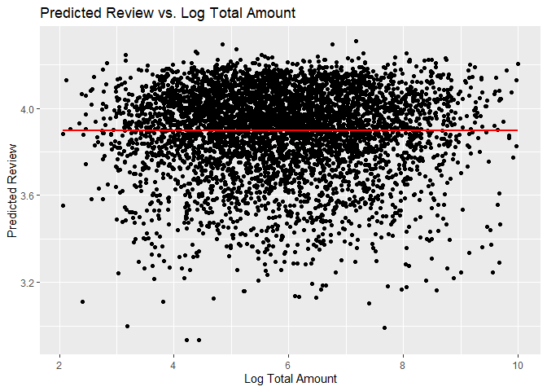<!-- -->
